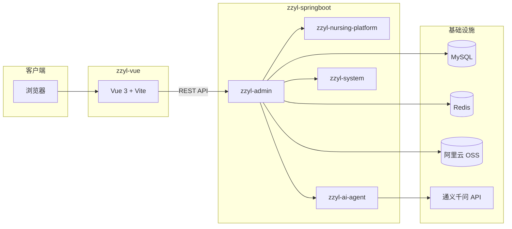

<div align="center">

# 🏥 中州养老 · Zhongzhou Pension

**面向养老机构的全栈数字化管理平台**

基于 **RuoYi v3.9.2** 二次开发，采用 Spring Boot 3 + Vue 3 前后端分离架构，覆盖护理业务、系统权限、AI 辅助等能力。

[](https://spring.io/projects/spring-boot)
[](https://vuejs.org/)
[](https://www.oracle.com/java/)
[](https://www.typescriptlang.org/)
[](LICENSE)

[快速开始](#-快速开始) · [功能特性](#-功能特性) · [技术栈](#-技术栈) · [项目结构](#-项目结构) · [配置说明](#-配置说明)

</div>

---

## 📖 项目简介

**中州养老（Zhongzhou Pension）** 是一套面向养老机构的业务管理系统，在若依（RuoYi）快速开发框架基础上，扩展了护理等级、护理项目、护理计划等养老核心业务模块，并集成 Spring AI 智能对话能力。

| 子项目 | 说明 | 目录 |
| :--- | :--- | :--- |
| **后端** | Spring Boot 3 多模块 Maven 工程 | [`zzyl-springboot/`](zzyl-springboot/) |
| **前端** | Vue 3 + TypeScript + Element Plus | [`zzyl-vue/`](zzyl-vue/) |

---

## ✨ 功能特性

### 养老业务

- 🩺 **护理等级管理** — 维护不同护理级别及对应标准
- 📋 **护理项目管理** — 护理服务项目的增删改查与状态管理
- 📝 **护理计划管理** — 制定与维护老人护理计划方案

### 平台能力

- 🔐 **权限体系** — JWT 认证、角色/菜单/按钮级权限控制
- 🛠 **代码生成** — 一键生成前后端 CRUD 代码
- 📊 **系统监控** — 服务监控、缓存监控、在线用户、操作日志
- ⏰ **定时任务** — Quartz 任务调度与执行日志
- 🤖 **AI 助手** — 基于 Spring AI 的对话接口（通义千问兼容模式）
- ☁️ **对象存储** — 阿里云 OSS 文件上传（环境变量配置）

---

## 🛠 技术栈

<table>
<tr>
<td width="50%" valign="top">

**后端 `zzyl-springboot`**

| 技术 | 版本 / 说明 |
| :--- | :--- |
| Spring Boot | 3.5.11 |
| Spring Security | JWT 鉴权 |
| MyBatis | 持久层 |
| Druid | 数据库连接池 |
| Redis | 缓存 / 会话 |
| MySQL | 8.x |
| Spring AI | 1.0.0 |
| SpringDoc | API 文档 |

</td>
<td width="50%" valign="top">

**前端 `zzyl-vue`**

| 技术 | 版本 / 说明 |
| :--- | :--- |
| Vue | 3.x |
| TypeScript | 类型安全 |
| Vite | 构建工具 |
| Element Plus | UI 组件库 |
| Pinia | 状态管理 |
| Vue Router | 路由 |
| Axios | HTTP 请求 |
| ECharts | 数据可视化 |

</td>
</tr>
</table>

---

## 🏗 系统架构



---

## 📁 项目结构

```
Zhongzhou-Pension/
├── README.md                 # 项目说明（本文件）
├── LICENSE                   # MIT 开源协议
├── zzyl-springboot/          # 后端工程
│   ├── zzyl-admin/           # 启动入口 & Web 层
│   ├── zzyl-nursing-platform/# 养老护理业务模块
│   ├── zzyl-ai-agent/        # AI 对话模块
│   ├── zzyl-system/          # 系统管理模块
│   ├── zzyl-framework/       # 框架核心
│   ├── zzyl-common/          # 公共工具
│   ├── zzyl-quartz/          # 定时任务
│   ├── zzyl-generator/       # 代码生成
│   ├── zzyl_oss/             # 对象存储
│   └── sql/                  # 数据库脚本
└── zzyl-vue/                 # 前端工程
    ├── src/
    │   ├── api/              # 接口定义
    │   ├── views/            # 页面组件
    │   └── ...
    └── vite.config.ts
```

---

## 🚀 快速开始

### 环境要求

| 依赖 | 版本建议 |
| :--- | :--- |
| JDK | 17+ |
| Maven | 3.8+ |
| Node.js | 18+ |
| MySQL | 8.0+ |
| Redis | 6.0+ |

### 1. 克隆仓库

```bash
git clone https://github.com/MMDXTMM/Zhongzhou-Pension.git
cd Zhongzhou-Pension
```

### 2. 初始化数据库

```bash
# 创建数据库
mysql -u root -p -e "CREATE DATABASE IF NOT EXISTS zzyl DEFAULT CHARACTER SET utf8mb4;"

# 导入主库脚本与定时任务脚本
mysql -u root -p zzyl < zzyl-springboot/sql/ry_20260417.sql
mysql -u root -p zzyl < zzyl-springboot/sql/quartz.sql
```

### 3. 启动后端

```bash
cd zzyl-springboot

# 修改 zzyl-admin/src/main/resources/application-druid.yml 中的数据库账号密码
# 修改 application.yml 中的 Redis 配置（如有密码）

# 启动（IDE 运行 RuoYiApplication，或使用 Maven）
mvn clean install -DskipTests
cd zzyl-admin
mvn spring-boot:run
```

后端默认地址：`http://localhost:8080`

### 4. 启动前端

```bash
cd zzyl-vue
npm install
npm run dev
```

前端默认地址：`http://localhost:80`（以 Vite 控制台输出为准）

### 5. 默认账号

| 账号 | 密码 |
| :--- | :--- |
| admin | admin123 |

---

## ⚙️ 配置说明

### 数据库 & Redis

编辑 `zzyl-springboot/zzyl-admin/src/main/resources/application-druid.yml`：

```yaml
spring:
  datasource:
    druid:
      master:
        url: jdbc:mysql://localhost:3306/zzyl?...
        username: root
        password: your_password
```

编辑 `application.yml` 中的 Redis 连接信息。

### 环境变量（可选）

| 变量名 | 用途 |
| :--- | :--- |
| `OPENAI_API_KEY` | AI 对话（通义千问兼容接口） |
| `ALIYUN_OSS_ACCESS_KEY_ID` | 阿里云 OSS AccessKey |
| `ALIYUN_OSS_ACCESS_KEY_SECRET` | 阿里云 OSS Secret |
| `ALIYUN_OSS_ENDPOINT` | OSS 端点，如 `oss-cn-beijing.aliyuncs.com` |
| `ALIYUN_OSS_BUCKET` | OSS Bucket 名称 |
| `ALIYUN_OSS_URL` | OSS 访问域名 |

> ⚠️ **请勿将密钥硬编码提交到仓库。** 生产环境请使用环境变量或密钥管理服务。

---

## 📦 后端模块说明

| 模块 | 职责 |
| :--- | :--- |
| `zzyl-admin` | 应用启动入口、Controller 聚合 |
| `zzyl-nursing-platform` | 护理等级 / 项目 / 计划等业务 |
| `zzyl-ai-agent` | Spring AI 智能对话 |
| `zzyl-system` | 用户、角色、菜单、字典等 |
| `zzyl-framework` | 安全、拦截器、AOP 等框架层 |
| `zzyl-common` | 工具类、常量、通用实体 |
| `zzyl-quartz` | 定时任务调度 |
| `zzyl-generator` | 代码生成器 |
| `zzyl_oss` | 阿里云 OSS 上传工具 |

---

## 🤝 致谢

本项目基于开源项目 [RuoYi-Vue](https://gitee.com/y_project/RuoYi-Vue) 进行二次开发，感谢若依团队提供的优秀框架。

---

## 📄 License

本项目采用 [MIT License](LICENSE) 开源协议。

---

<div align="center">

**如果这个项目对你有帮助，欢迎 Star ⭐**

Made with ❤️ by [MMDXTMM](https://github.com/MMDXTMM)

</div>
